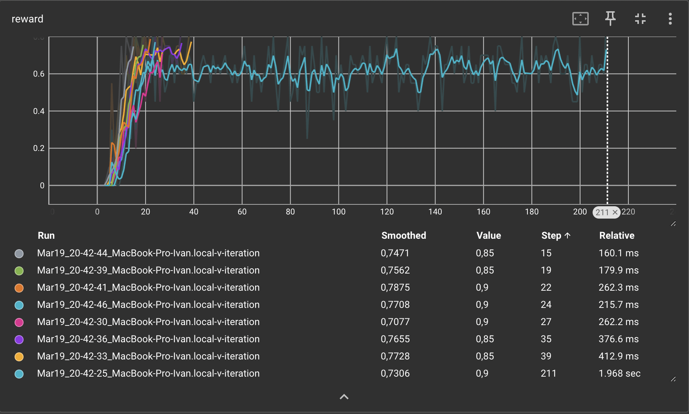
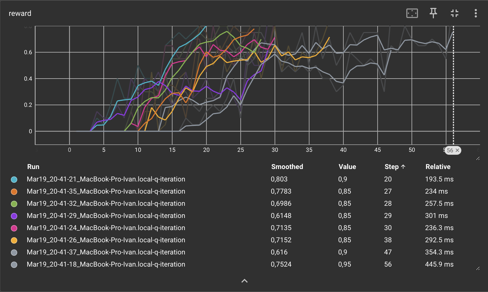
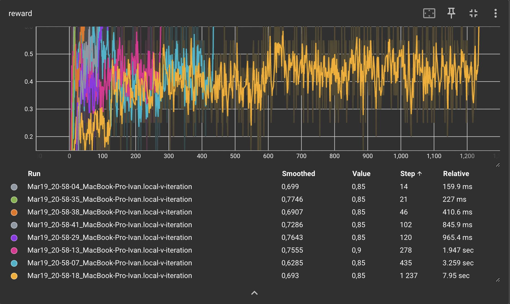
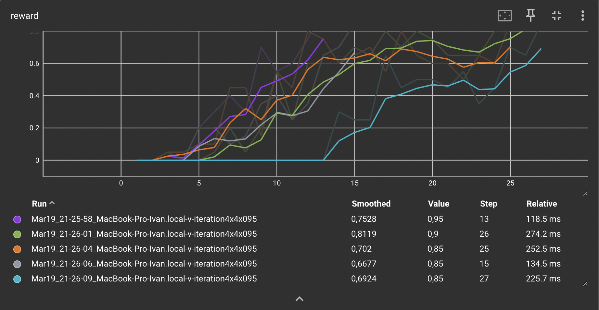
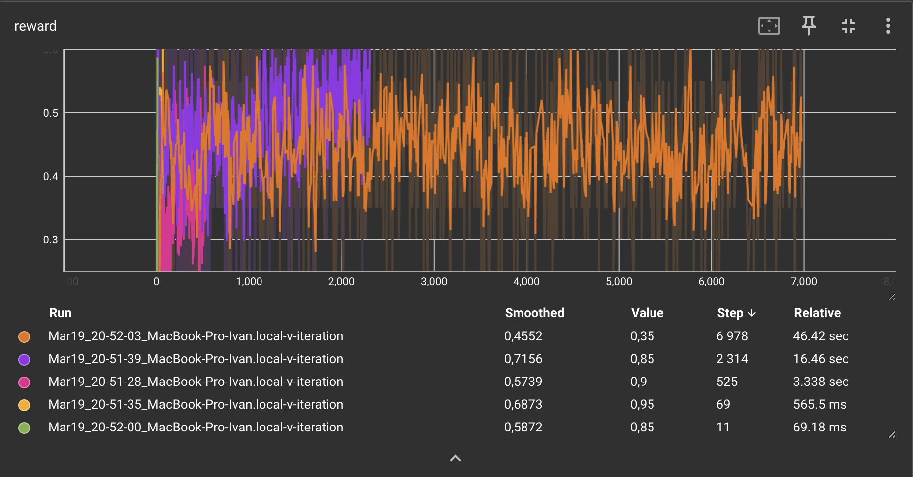
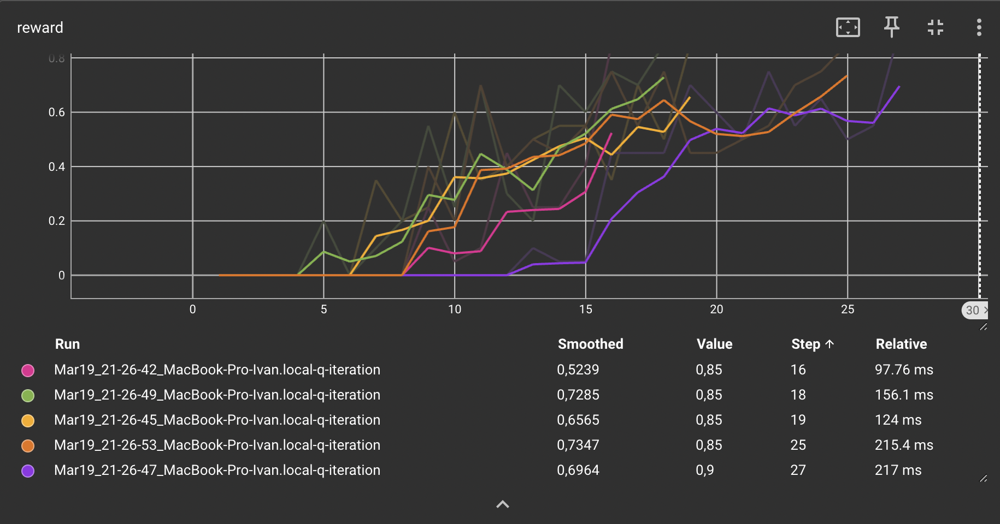
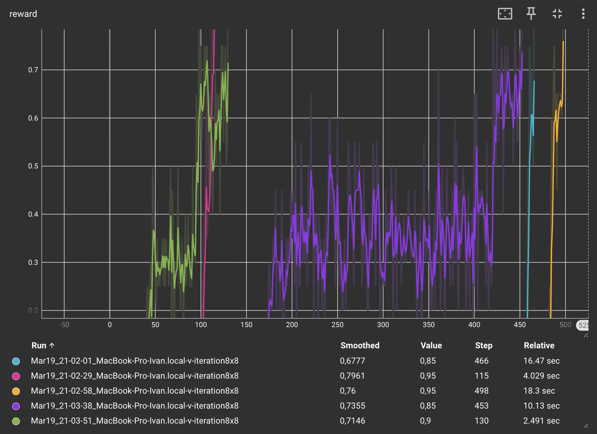
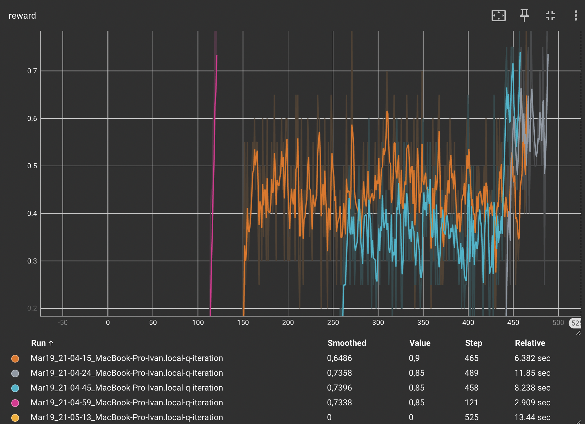

### Отчет 2. 
### Исследование метода Q-learning в среде Frozen Lake 

### 1. Сравнение алгоритмов V и Q learning
Для алгоритма `V learning` на поле (4х4) при `gamma=0.9` сходимость (mean reward > 0.80) достигается в среднем за 49 итераций (Standard Deviation = 65.9372). 
Графики зависимости reward от количества итераций приведены ниже. 

Для алгоритма `Q learning` на поле (4х4) при `gamma=0.9` сходимость (mean reward > 0.80) достигается в среднем за 34.375 итерации (Standard Deviation = 11.891624). 
Графики зависимости reward от количества итераций приведены ниже. 

**Вывод:** Алгоритм обучения `Q learning` оказался более эффективным в терминах количества итераций так как каждая итерация требует больше вычислений.

## 2. Влияние гиперпараметра `GAMMA` на скорость сходимости.

Для алгоритма `V learning` на поле (4х4) при `gamma=0.8` сходимость (mean reward > 0.80) достигается в среднем за 281.625 итерации (Standard Deviation = 412.26446). 
Графики зависимости reward от количества итераций приведены ниже. 

Для алгоритма `V learning` на поле (4х4) при `gamma=0.95` сходимость (mean reward > 0.80) достигается в среднем за 21.2 итерации (Standard Deviation = 6.6483081). 
Графики зависимости reward от количества итераций приведены ниже. 

Для алгоритма `Q learning` на поле (4х4) при `gamma=0.8` сходимость (mean reward > 0.80) достигается в среднем за 1979.4 итерации (Standard Deviation = 2946.9249). 
Графики зависимости reward от количества итераций приведены ниже. 

Для алгоритма `Q learning` на поле (4х4) при `gamma=0.95` сходимость (mean reward > 0.80) достигается в среднем за 21 итерации (Standard Deviation = 4.7434165). 
Графики зависимости reward от количества итераций приведены ниже.

**Вывод:** Увеличение гиперпараметра `GAMMA` приводит к ускорению обучения так как алгоритм становится менее жадным и в большей степени пологается на долгосрочно оптимальную стратегию.

## 3. Сравнение алгоритмов V и Q learning на поле большего размера.

Для алгоритма `Q learning` на поле (8х8) при `gamma=0.9` сходимость (mean reward > 0.80) достигается в среднем за 332.4 итерации (Standard Deviation = 192.38321). 
Графики зависимости reward от количества итераций приведены ниже.

Для алгоритма `Q learning` на поле (8х8) при `gamma=0.9` сходимость (mean reward > 0.80) достигается в среднем за 411.6 итерации (Standard Deviation = 164.54726). 
Графики зависимости reward от количества итераций приведены ниже.

**Вывод:** При квадратичном росте размера пространства состояний количество ресурсов, необходимых для обучения алгоритма, также растет квадратично.
