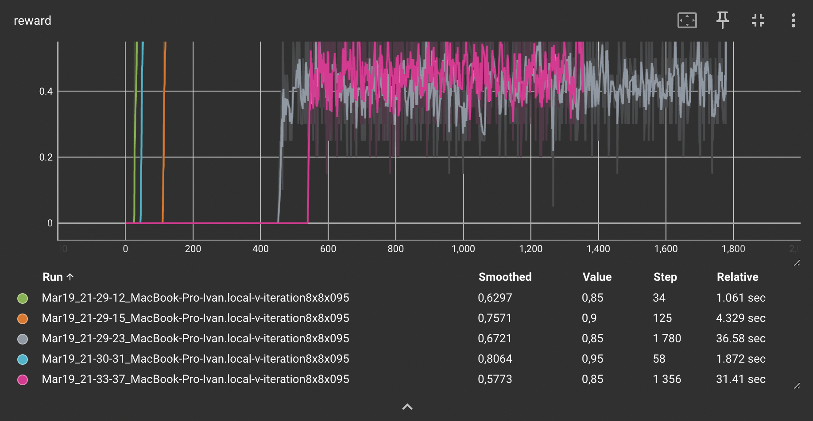
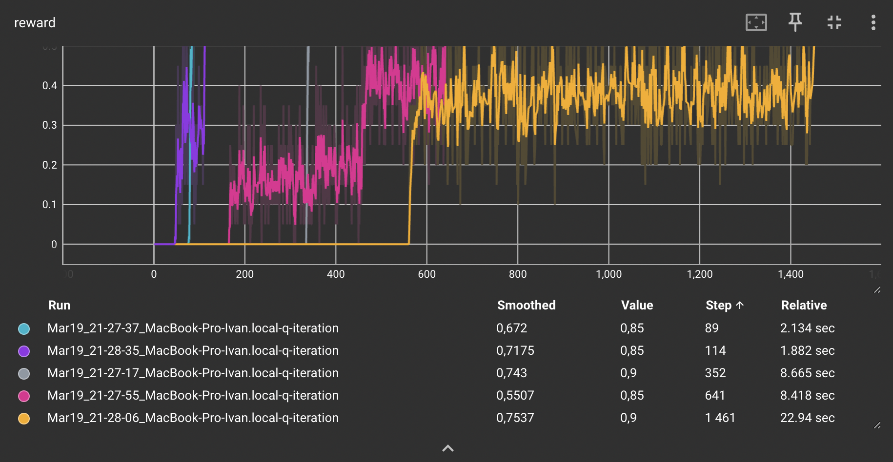

### Отчет 2. 
### Исследование метода Q-learning в среде Frozen Lake 

### 1. Сравнение алгоритмов V и Q learning
Для алгоритма `V learning` на поле (4х4) при `gamma=0.9` сходимость (mean reward > 0.85) достигается в среднем за 53 итерации (от 30 до 85). 
Графики зависимости reward от количества итераций приведены ниже. 

Standard Deviation = 65.9372
Mean = 49

Для алгоритма `Q learning` на поле (4х4) при `gamma=0.9` сходимость (mean reward > 0.85) достигается в среднем за 53 итерации (от 30 до 85). 
Графики зависимости reward от количества итераций приведены ниже. 

Standard Deviation = 11.891624
Mean	34.375

**Вывод:** Алгоритм обучения ценности состояний более эффективен чем обучение ценности действий. Это связано с тем, что ... 

## 2. Влияние гиперпараметра `GAMMA` на скорость сходимости . (2 балла)

Для алгоритма `Q learning` на поле (4х4) при `gamma=0.8` сходимость (mean reward > 0.85) достигается в среднем за 53 итерации (от 30 до 85). 
Графики зависимости reward от количества итераций приведены ниже. 
Standard Deviation = 412.26446
Mean = 281.625

Для алгоритма `Q learning` на поле (4х4) при `gamma=0.8` сходимость (mean reward > 0.85) достигается в среднем за 53 итерации (от 30 до 85). 
Графики зависимости reward от количества итераций приведены ниже. 

Standard Deviation = 6.6483081
Mean = 21.2

Для алгоритма `Q learning` на поле (4х4) при `gamma=0.8` сходимость (mean reward > 0.85) достигается в среднем за 53 итерации (от 30 до 85). 
Графики зависимости reward от количества итераций приведены ниже. 

Standard Deviation = 2946.9249
Mean = 1979.4

Для алгоритма `Q learning` на поле (4х4) при `gamma=0.8` сходимость (mean reward > 0.85) достигается в среднем за 53 итерации (от 30 до 85). 
Графики зависимости reward от количества итераций приведены ниже. 

Standard Deviation = 4.7434165
Mean = 21

**Вывод:** Увеличение гиперпараметра `GAMMA` приводит к ... Это связано с тем, что ...   

Уменьшение гиперпараметра `GAMMA` приводит к ... Это связано с тем, что ... 

## 3. Сравнение алгоритмов V и Q learning на поле большего размера (3 балла)

Для алгоритма `Q learning` на поле (4х4) при `gamma=0.8` сходимость (mean reward > 0.85) достигается в среднем за 53 итерации (от 30 до 85). 
Графики зависимости reward от количества итераций приведены ниже. 

Standard Deviation = 192.38321
Mean = 332.4

Для алгоритма `Q learning` на поле (4х4) при `gamma=0.8` сходимость (mean reward > 0.85) достигается в среднем за 53 итерации (от 30 до 85). 
Графики зависимости reward от количества итераций приведены ниже. 

Standard Deviation = 833.48053
Mean = 670.6

Для алгоритма `Q learning` на поле (4х4) при `gamma=0.8` сходимость (mean reward > 0.85) достигается в среднем за 53 итерации (от 30 до 85). 
Графики зависимости reward от количества итераций приведены ниже. 

Standard Deviation = 164.54726
Mean = 411.6

Для алгоритма `Q learning` на поле (4х4) при `gamma=0.8` сходимость (mean reward > 0.85) достигается в среднем за 53 итерации (от 30 до 85). 
Графики зависимости reward от количества итераций приведены ниже. 

Standard Deviation = 565.30815
Mean = 531.4

