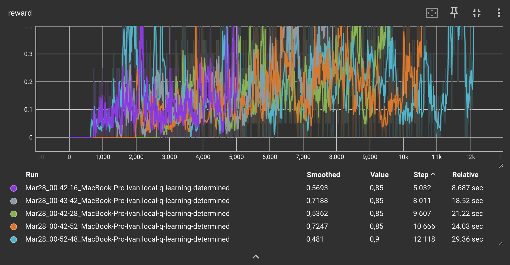
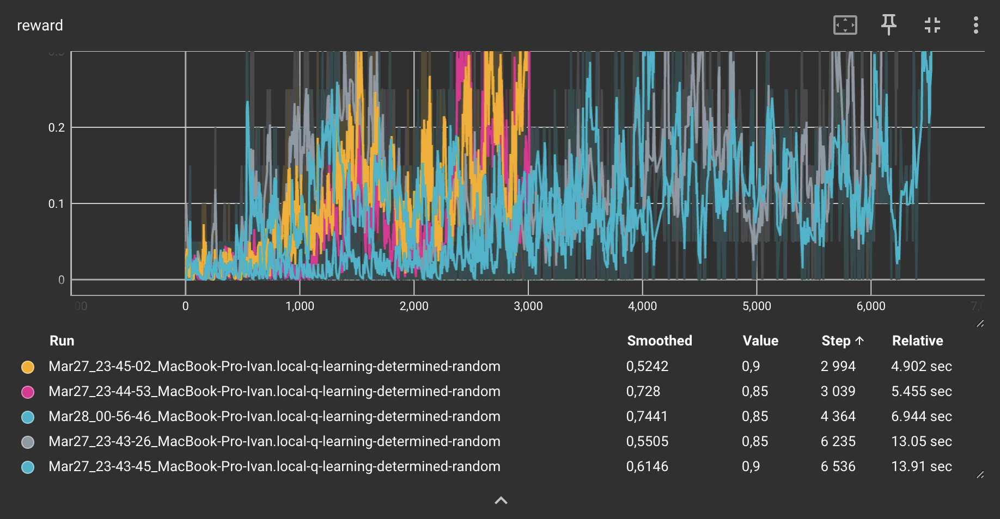
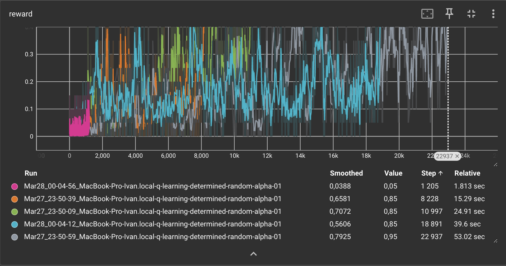
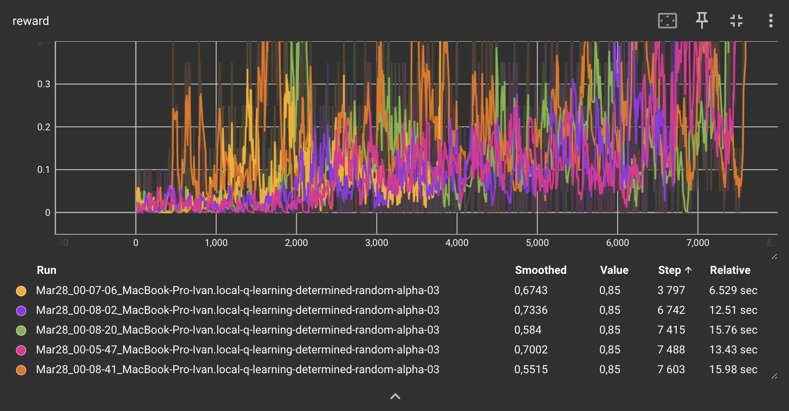
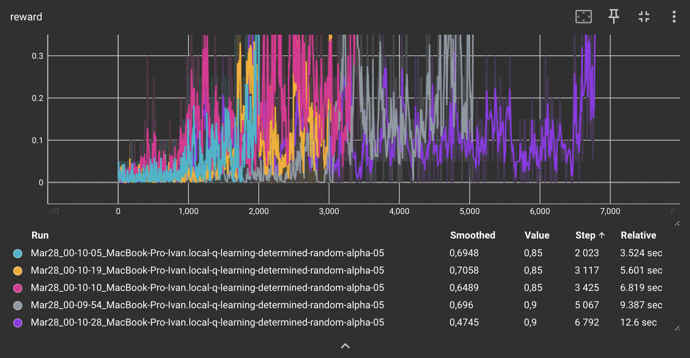
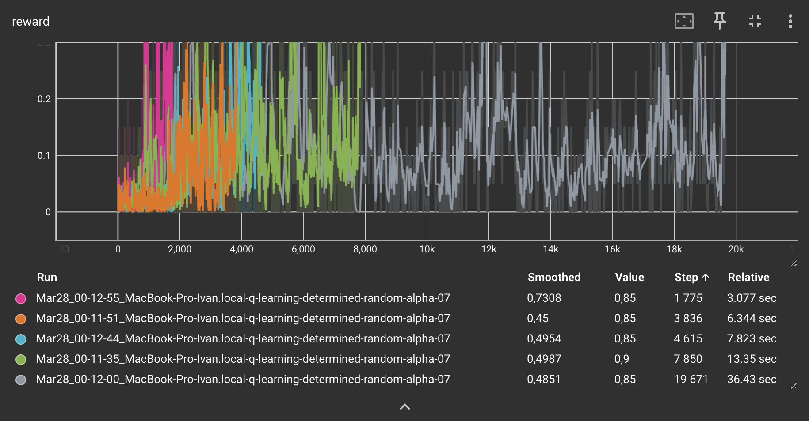
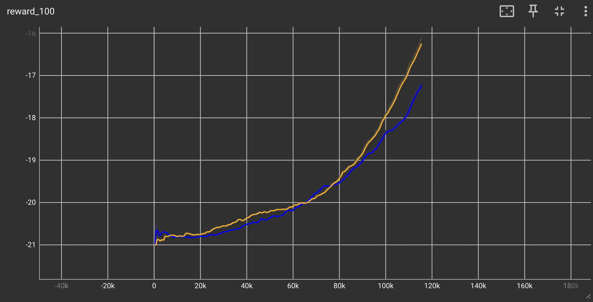

### Отчет 2. 
### Исследование метода Q-learning в среде Frozen Lake 

### 1. Исследование алгоритма `tabular Q learning`

В базовой версии алгоритма при GAMMA = 0.9 и ALPHA = 0.2 сходимость (mean reward > 0.80) достигается в среднем за 9086 итераций (Standard Deviation = 2718.0601).

В рандомизированной версии алгоритма при GAMMA = 0.9 и ALPHA = 0.2 сходимость (mean reward > 0.80) достигается в среднем за 4633.6 итераций (Standard Deviation = 1694.6481). Таким образом, рандомизированная версия оказалась болле робасной и быстро сходящейся.

В рандомизированной версии алгоритма при GAMMA = 0.9 и ALPHA = 0.1 сходимость (mean reward > 0.80) достигается в среднем за 12451.6 итераций (Standard Deviation = 8629.1679).

В рандомизированной версии алгоритма при GAMMA = 0.9 и ALPHA = 0.3 сходимость (mean reward > 0.80) достигается в среднем за 6609 итераций (Standard Deviation = 1607.4316).

В рандомизированной версии алгоритма при GAMMA = 0.9 и ALPHA = 0.5 сходимость (mean reward > 0.80) достигается в среднем за 4084.8 итераций (Standard Deviation = 1865.2507).

В рандомизированной версии алгоритма при GAMMA = 0.9 и ALPHA = 0.7 сходимость (mean reward > 0.80) достигается в среднем за 7549.4 итераций (Standard Deviation = 7119.8189).

**Вывод:** Таким образом, по полученным экспериментальным данным оптимальное значение параметра ALPHA = 0.5.

### 2. Обучение DQN.

Обучение занимало слишком много времени, поэтому обучение велось 400 игр или ~115000 шагов.

В результете была обучена сеть набирающая ~-17 очков.

https://github.com/pgkgone/rl_course/assets/22062599/fff09945-d07b-45c0-8035-63e664e95c50

### 3. Оптимизация гипер параметров.

Из-за длительности обучения возможности по эксперемнтированию с гипер параметрами были ограничены.

Learning-rate = 1e-3 - обучить модель не удалось.

REPLAY_SIZE = 1000; SYNC_TARGET_FRAMES = 1000; REPLAY_START_SIZE = 1000 - обучить модель не удалось.

BATCH_SIZE = 64 - сеть была обучена. Средний reward ~-16 очков, при этом увеличение времени составило - 42.31%. Таким образом, в отличае от большинства классических deeplearning алгоритмов в данной реализации увеличение batch size'a не приводит к увеличению производительности обучения. 

https://github.com/pgkgone/rl_course/assets/22062599/5e8a45c2-ff62-4649-b76f-a78df556f167

